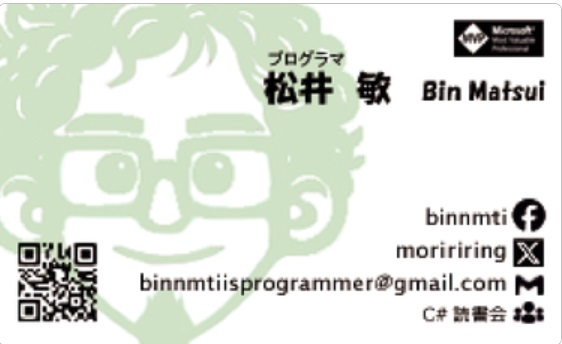

# 基本情報

| key      | value                    |
| -------- | ------------------------ |
| 氏名     | 松井 敏                  |
| 生年月日 | 1976年生まれ              |
| 居住地   | 京都府                   |
| 最終学歴 | 大阪ゲームデザイナー学院 |

---

# イントロダクション
私はこれまでの経験を生かして新しいステップを模索していますが、どの方向に進むべきかを見極めている段階です。私はプログラマとして必要なものを自分で作るスキルを持っています。約 20 年間、仕事ではゲームや Windows アプリ開発、趣味では Web サービス開発を行ってきました。しかし、世の中の無限の可能性の中で、自分が何をできるか、何をしたいかを具体的に見つけたいと考えています。このため、企業でも個人でも、私と一緒に仕事をしたい、あるいは一緒に何かを作りたいと感じてくださる方とお話ししたいと考えました。たとえばプログラマがいない業種でも、自分が入ることでシステム改善や効率化のサポートができると考えており、業界を問わず柔軟に貢献できる場を求めています。ご縁があれば、フルタイムでの就職につながるかもしれませんし、副業的な関わり方やアドバイザー的な形で数回サポートすることも可能だと思っています。新たな視点やアイデアが生まれることを期待しており、まずは気軽に話していただければと思います。このメッセージに興味を持ってくださった方がいらっしゃいましたら、ぜひお気軽に[フォーム](https://forms.gle/cUFBadG8FXLJzPBPA)からご連絡ください。お互いに新しい視点を共有できればと思っています。よろしくお願いします。

---

# 自己 PR

私はプログラマとしてゲーム開発や大規模システムの開発を行ってきました。業務では主に C++、C#を使った Windows 開発が中心で、テストやレビューの提案・実施も積極的に行っています。また、プロジェクトの合間に CI/CD ツールやアニメーションシステムを導入し、社内イベントや勉強会の開催にも携わってきました。リーダー業務も経験しています。副業で CI/CD テストの導入や技術面談や採用、またスクール講師なども経験しており、共著で書籍も 1 冊執筆しました

個人開発では、ゼロから Web 系技術の学習を進め、Azure を活用したクラウドベースのインフラ構築や、Blazor を使用したフロントエンド開発、ASP.NET によるサーバーサイド処理を一貫して作りました。また、Firebase や React、TypeScript のサービスも現在作成中です。

私は特に C#の技術を中心に活動しており、ハッカソンや勉強会を通じて 30 回以上のイベントを実施。読書会は 10 年間で 200 回以上開催し、また C#、自動化、CI を中心に、セッションに 50 回以上登壇。これらの活動により Microsoft MVP を 12 回受賞しています。

---

# やりたい仕事

プログラムを書いてモノを作るのが大好きで、面白いアイデアを実現する仕事に関心があります。また、作ったモノを改善していくことにやりがいを感じるため、自社サービスを展開している会社に興味があります。特にゲーム業界、Web 業界、Web3 業界は興味があります。リーダー業務も問題ありませんが、実際にコードを書く仕事で力を発揮したいと考えています。技術的には C++/C#が好きで、Windows、Web、ゲームなど幅広く対応できます。新しい技術へのチャレンジも歓迎です。フルリモートが必須ではありませんが、出来れば選択肢としてリモートが選べる会社だと嬉しいです。

---

# 職務経歴

## [株式会社 Codeer](https://www.codeer.co.jp/)　（2015/11〜2024/11）

> テクニカルマネージャー/コンサルタントとして、株式会社キーエンスに出向し、C++、C#プログラマとして開発およびテストを担当。リーダー業務も経験。

## [株式会社コナミデジタルエンタテイメント](https://www.konami.com/games/corporate/ja/)（2005/07〜2015/11）

> 基幹技術班として、デザイナ支援やツールの開発、自動化システムの導入に従事。リーダーとしてデザイナのサポートや社内システムの構築も担当。多数のゲームタイトルに携わり、CI ツールの導入も行う。

- [実況パワフルプロ野球](https://www.konami.com/pawa/app/) (スマートフォン）
- パワフルプロ野球 ～毎日がクライマックス！　～ (スマートフォン）
- ドリームスタリオン（モバイル）
- [ワールドサッカーコレクション](https://www.konami.com/games/jp/ja/products/sns_wscs/)(モバイル）
- [実況パワフルプロ野球 2016](https://www.konami.com/pawa/2016/)(PS4,PS3,PSVITA)
- 実況パワフルプロ野球 2014(PS3,PSVITA)
- 実況パワフルプロ野球 2013(PS3,PSVITA,PSP)
- 実況パワフルプロ野球 2012 決定版（PS3,PSVITA,PSP)
- 実況パワフルプロ野球 2012(PS3,PSVITA,PSP)
- 実況パワフルプロ野球 2011 決定版（PS3,PSP)
- 実況パワフルプロ野球 2011(PS3,PSP)
- [プロ野球スピリッツ 2015](https://www.konamistyle.jp/products/detail.php?product_id=73039)(PS3,PSVITA)
- プロ野球スピリッツ 2014(PS3,PSVITA,PSP)
- プロ野球スピリッツ 2013(PS3,PSVITA,PSP)
- プロ野球スピリッツ 2012(PS3,PSVITA,PSP)
- プロ野球スピリッツ 2011(PS3,3DS,PSP)
- プロ野球スピリッツ 2010(PS2,PS3,PSP)
- MLB ボブルヘッド！　(PS3)
- プロ野球スピリッツ 2010(PSP)
- 実況パワフルメジャーリーグ 2009(PS2,Wii)
- 実況パワフルメジャーリーグ 3, MLB POWER PROS2(PS2,Wii)
- 実況パワフルメジャーリーグ 2, MLB POWER PROS(PS2,Wii)
- 実況パワフルメジャーリーグ（PS2、ゲームキューブ）

## 株式会社クライマックス（2001/10〜2005/07）

> ゲームプログラマとして、C++やアセンブラを使用し、パチンコやコンシューマゲームの開発に従事。プロジェクトの全システムを担当する経験を積む。

- CR フィーバーパワフルゼロ（パチンコ）
- 陰陽大戦記 (PS2)
- I Love Baseball (PS2)
- CR 二天一流 (パチンコ）
- CR すっちー物語（パチンコ）

## [株式会社トーセ](https://www.tose.co.jp/)（1999/04〜2001/09）

> C/C++を用いたゲーム開発に携わり、UI やゲームシステムを担当。OpenGL を使用した Windows 用 3D ツールの作成経験あり。

- 川のぬし釣り～不思議の森から～(GB アドバンス）
- 優駿ラプソティ (GB アドバンス）
- がんばれ！　ニッポン！　オリンピック 2000 (ドリームキャスト）
- 実況パワフルプロ野球（ドリームキャスト）
- ドラゴンクエストモンスターズ（PS）
- テーマアクアリウム（Windows）

---

## 副業

## [株式会社 HACARUS](https://hacarus.com/ja/)（2022/07〜現在）

> C#及び CI/CD の技術指導。GitLab の CI/CD 導入。ユニットテスト・E2E テストの導入。ペアプログラミング、[モブプログラミング](https://www.wantedly.com/companies/hacarus/post_articles/490952)の実践。新規システムの技術提案。C#の社内勉強会、社内読書会、社外勉強会の実践。技術課題の選定・技術面接担当。

## [バンタンゲームアカデミー大阪校](https://www.vantan-game.com/)（2015/11〜2016/04）

> ハッカソン形式による実践授業

---

# 個人活動

以前は本名を出さずにハンドルネームで活動。その後本名へ移行したためインターネット上の資料などの名前は旧名のものもあり。

| key  | value                            |
| ---- | -------------------------------- |
| 氏名 | binnmti a.k.a 森理麟(moririring) |

## [C#読書会](https://cs-reading.connpass.com/)主催

> C#読書会は基本隔週で開催していて 10 年間で 200 回以上続けており過去の参加者は 300 人以上。現在でも変わらず進行中。コロナ下でもリモートで続けており最近はハイブリッドで開催。また派生して開催したモブプロ会も 4 年ぐらいやっていた。一時期は[メタバースモブプロ](https://note.com/binnmti/n/n60e5524c887d)でも実施。24 年の 4 月には 200 回記念で勉強会も開催。

| タイトル                                                                                                 | 期間               | 回数     |
| -------------------------------------------------------------------------------------------------------- | ------------------ | -------- |
| [DI の原理・原則とパターン](https://cs-reading.connpass.com/event/324373/)                               | 2024/07 ～ 現在    | 全 - 回  |
| [C#ベクトルプログラミング入門](https://cs-reading.connpass.com/event/305230/)                            | 2024/01 ～ 2024/06 | 全 11 回 |
| [C#パフォーマンス勉強会(C#読書会 200 回記念)](https://cs-reading.connpass.com/event/309714/)             | 2024/04/27         | 約 60 人 |
| [モブプログラミング会](https://cs-reading.connpass.com/event/239339/)                                    | 2022/02 ～ 2024/03 | 全 46 回 |
| [WEB ドキュメント C# 11 の新機能](https://cs-reading.connpass.com/event/288128/)                         | 2023/07 ～ 2023/10 | 全 5 回  |
| [WEB ドキュメント C# 10 の新機能](https://cs-reading.connpass.com/event/280992/)                         | 2023/04 ～ 2023/06 | 全 5 回  |
| [WEB ドキュメント C# 9.0 の新機能](https://cs-reading.connpass.com/event/271814/)                        | 2023/01 ～ 2023/04 | 全 7 回  |
| [WEB ドキュメント C# 8.0 の新機能](https://cs-reading.connpass.com/event/256658/)                        | 2022/08 ～ 2022/11 | 全 8 回  |
| [マンガ読んだ！！ペアプロ](https://manga-yonda.connpass.com/event/192743/)                               | 2020/09 ～ 2021/07 | 全 20 回 |
| [C#によるマルチコアのための非同期/並列処理プログラミング](https://cs-reading.connpass.com/event/225326/) | 2021/09 ～ 2022/07 | 全 20 回 |
| [Effective C# 6.0/7.0](https://cs-reading.connpass.com/event/186596/)                                    | 2020/09 ～ 2021/09 | 全 26 回 |
| [.NET のエンタープライズアプリケーションアーキテクチャ](https://cs-reading.connpass.com/event/89435/)    | 2018/06 ～ 2020/08 | 全 48 回 |
| [.NET のクラスライブラリ設計](https://cs-reading.connpass.com/event/55643/)                              | 2017/05 ～ 2018/05 | 全 24 回 |
| [C#ショートコードプログラミング](https://cs-reading.connpass.com/event/37330/)                           | 2016/08 ～ 2017/04 | 全 14 回 |
| [C#実践開発手法](https://cs-reading.doorkeeper.jp/events/27896)                                          | 2015/07 ～ 2016/06 | 全 19 回 |
| [EffectiveC#4.0](https://cs-reading.doorkeeper.jp/events/15303)                                          | 2014/10 ～ 2015/06 | 全 16 回 |

## [VS ハッカソン倶楽部](https://vshtc.doorkeeper.jp/)主催

> Visual Studio を使ったハッカソンを 定期的に開催するコミュニティを立ち上げた。派生して勉強会も開催していた（現在は C#読書会へ移行）。

| タイトル                                                                                                           | 期間       | 参加人数 |
| ------------------------------------------------------------------------------------------------------------------ | ---------- | -------- |
| [Osaka ComCamp 2016 powered by MVPs](https://connpass.com/event/24027/)                                            | 2016/02/20 | 約 90 人 |
| [Windows アプリテスト自動化勉強会 -Friendly ハンズオン（基本編 その 2）](https://vshtc.doorkeeper.jp/events/32528) | 2015/10/30 | 約 20 人 |
| [Windows アプリテスト自動化勉強会 -Friendly ハンズオン（基本編）](https://vshtc.doorkeeper.jp/events/30737)        | 2015/09/24 | 約 26 人 |
| [CI 勉強会](https://vshtc.doorkeeper.jp/events/26853)                                                              | 2015/07/11 | 約 28 人 |
| [機械学習(Azure Machine Learning)初心者向けハンズオン勉強会](https://vshtc.doorkeeper.jp/events/24976)             | 2015/06/12 | 約 43 人 |
| [++C++と C#++について駄弁る会](https://vshtc.doorkeeper.jp/events/23208)                                           | 2015/05/02 | 約 23 人 |
| [ASP.NET 初心者向け勉強会](https://vshtc.doorkeeper.jp/events/22638)                                               | 2015/04/11 | 約 31 人 |
| [UnrealEngine 初心者向けハンズオン勉強会](https://vshtc.doorkeeper.jp/events/19810)                                | 2015/02/14 | 約 29 人 |
| [TypeScript 勉強会](https://vshtc.doorkeeper.jp/events/11407)                                                      | 2014/06/14 | 約 54 人 |
| [今日から始める Git & GitHub 入門（リバイバル+α）](https://vshtc.doorkeeper.jp/events/11099)                       | 2014/05/11 | 約 27 人 |
| [非同期勉強会](https://vshtc.doorkeeper.jp/events/10442)                                                           | 2014/05/31 | 約 68 人 |
| [2D ゲームハッカソン 2Days](https://vshtc.doorkeeper.jp/events/9487)                                               | 2014/04/19 | 約 40 人 |
| [今日から始める Git & GitHub 入門](https://vshtc.doorkeeper.jp/events/10274)                                       | 2014/04/16 | 約 30 人 |
| 2D ゲームハッカソン 2Days(アイデアソン)                                                                            | 2014/04/12 | 約 40 人 |
| [第 3 回 LINQ 勉強会](https://vshtc.doorkeeper.jp/events/6781)                                                     | 2013/12/14 | 約 35 人 |
| [C#の素晴らしさを語る会](https://vshtc.doorkeeper.jp/events/5897)                                                  | 2013/10/12 | 約 36 人 |
| [第 2 回 LINQ 勉強会](https://vshtc.doorkeeper.jp/events/5495)                                                     | 2013/08/24 | 約 12 人 |
| .NET Micro Framework ハッカソン                                                                                    | 2013/07/27 | 約 16 人 |
| [.NET Micro Framework ハッカソン事前勉強会 B-Side](https://vshtc.doorkeeper.jp/events/4606)                        | 2013/07/26 | 約 12 人 |
| [.NET Micro Framework ハッカソン事前勉強会 A-Side](https://vshtc.doorkeeper.jp/events/4543)                        | 2013/07/19 | 約 13 人 |
| TypeScript ハッカソン 2Days ハッカソン                                                                             | 2013/04/27 | 約 14 人 |
| TypeScript ハッカソン 2Days アイデアソン                                                                           | 2013/04/20 | 約 14 人 |
| Visual Studio 勉強会                                                                                               | 2013/03/09 | 約 42 人 |
| TDDBC 大阪 for C#                                                                                                  | 2013/01/18 | 約 22 人 |
| Unity ハッカソン 2Days(ハッカソン)                                                                                 | 2012/10/20 | 約 40 人 |
| Unity ハッカソン 2Days(アイデアソン)                                                                               | 2012/10/13 | 約 40 人 |
| Visual Studio ハッカソン（ゆるめ）                                                                                 | 2012/08/18 | 約 20 人 |
| MetroStyle 2Days(ハッカソン)                                                                                       | 2012/07/21 | 約 30 人 |
| MetroStyle 2Days(アイデアソン)                                                                                     | 2012/07/14 | 約 25 人 |
| Visual Studio ハッカソン（ゆるめ）                                                                                 | 2012/04/28 | 約 20 人 |

## 登壇

> 2011 年から勉強会を中心としたスピーカーとしての発表を行う。話す内容は 自動化, CI/CD, C#が多い。（発表資料は[docswell](https://www.docswell.com/user/binnmti)で公開。非公開や削除した資料も多く、一部のみ公開中。）

| 勉強会                                                                                                               | 日付       | タイトル                                                                                                                                   |
| -------------------------------------------------------------------------------------------------------------------- | ---------- | ------------------------------------------------------------------------------------------------------------------------------------------ |
| Alpha+ 2nd Sep Online                         | 2024/10/26 | 並行並列プログラミング                                    |
| [AI 時代のソフトウェアエンジニアリングと教育](https://gdgkwansai.connpass.com/event/327195/)                         | 2024/09/21 | 教育と AI を語るハンズオン：プロンプトソン × モブプログラミング × ブレークアウトルームディスカッション                                     |
| [C#パフォーマンス勉強会](https://cs-reading.connpass.com/event/309714/)                                              | 2024/04/27 | ベクトルプログラミングと unsafe                                                                                                            |
| [IT エンジニア交流会 in Kyoto](https://mit.connpass.com/event/297879/)                                               | 2023/11/13 | 個人開発者は電子兎の夢を見るか？ ～ルンバを買うと床にモノを置かなくなる～(LT)                                                               |
| Alpha+ Project Boot Camp                                                                                             | 2023/09/09 | モブプロミング                                                                                                                             |
| Alpha+ Project Boot Camp                                                                                             | 2023/08/19 | CI/CD について                                                                                                                             |
| [勉強法の勉強会](https://yumemi.connpass.com/event/281721/)                                                          | 2023/05/15 | 技術書を集中して読むために新たに始めた方法が自分にクリティカルヒットした話                                                                 |
| [Developers Summit 2020 KANSAI](https://event.shoeisha.jp/devsumi/20200827)                                          | 2020/08/27 | C#読書会の紹介(LT)                                                                                                                         |
| [Mix Leap 2 周年記念！！第 2 回制作物天下一武道会](https://lycorp-osaka-jp.connpass.com/event/147719/)               | 2019/10/31 | マンガ読んだ！ ！ LT                                                                                                                         |
| [Developers Summit 2019 KANSAI](https://event.shoeisha.jp/devsumi/20190927)                                          | 2019/09/27 | C#読書会の紹介(LT)                                                                                                                         |
| [meetup app osaka@3](https://meetupapp.connpass.com/event/112659/)                                                   | 2019/06/22 | Blazor と踊ろう                                                                                                                            |
| [Visual Studio 2019 Launch at Kansai](https://meetupapp.connpass.com/event/112659/)                                  | 2018/12/22 | Blazor+Identity                                                                                                                            |
| [.NET Conf 関西 2018](https://connpass.com/event/97856/)                                                             | 2018/10/06 | Bye-bye ASP.NET MVC, Hello ASP.NET SPA!                                                                                                    |
| [デブサミ関西 2018](https://event.shoeisha.jp/devsumi/20180928/)                                                     | 2018/09/28 | C#読書会の紹介(LT)                                                                                                                         |
| [Global Azure Bootcamp 2018@Kansai](https://connpass.com/event/82263/)                                               | 2018/04/21 | How to make WebSite by Azure                                                                                                               |
| [第 6 回 PowerShell 勉強会](https://jpposh.doorkeeper.jp/events/38591/)                                              | 2016/04/09 | クライアントで PowerShell を使ってみて                                                                                                     |
| [ゲーム開発環境勉強会＠関西＃３](https://game-des-kansai.doorkeeper.jp/events/34267/)                                | 2015/12/13 | CI と CD                                                                                                                                   |
| [Developers Summit 2015 KANSAI](https://event.shoeisha.jp/devsumi/20150904/)                                         | 2015/09/04 | VS ハッカソン倶楽部の紹介(LT)                                                                                                              |
| [CEDEC 2015](https://cedec.cesa.or.jp/2015/session/PRD/5794.html)                                                    | 2015/08/28 | インハウス継続的インテグレーションツールによるゲーム運用全般の自動化について                                                               |
| [CEDEC 2015](https://cedec.cesa.or.jp/2015/session/VA/5847.html)                                                     | 2015/08/28 | プロ野球スピリッツ 2015 の 3D フォトスキャン活用事例 ～我々は如何にして 500 名以上もの野球選手のリアリスティックな顔モデルを作成したか～て |
| [CI 勉強会](https://vshtc.doorkeeper.jp/events/26853)                                                                | 2015/07/11 | Windows で bat と PowerShell で CI！                                                                                                       |
| Ashiyan Automation Alliance 2015                                                                                     | 2015/06/27 | Game’s Continuous Delivery                                                                                                                 |
| [Unity クリエイターズ 「Unity5 3D ゲーム開発講座」出版記念勉強会](https://unitycreators.doorkeeper.jp/events/21735/) | 2015/03/14 | Unity でもう少し C#を書きたい人のための LINQ 入門                                                                                          |
| [Room metro #30 大阪](http://metrostyledev.net/index.php/event/20150228/)                                            | 2015/02/28 | 仮想化技術まとめ+Windows 周りで =自分的運用失敗談                                                                                          |
| [Windows での自動化について考える会](https://connpass.com/event/11779/)                                              | 2015/02/21 | Windows の自動化今昔先物語                                                                                                                 |
| [第 1 回 Hubot×ChatOps 勉強会](https://hubot-chatops.connpass.com/event/9370/)                                       | 2014/11/22 | CI × Log × Mail × Chat(LT)                                                                                                                 |
| [第 4 回 PowerShell 勉強会](https://jpposh.doorkeeper.jp/events/14261/)                                              | 2014/10/11 | PowerShell はじめました                                                                                                                    |
| [Room metro #26 大阪 & VS ハッカソン倶楽部 共催](http://metrostyledev.net/index.php/event/20140712/)                 | 2014/07/12 | あなたの気になるフレームワーク特集「Unity」                                                                                                |
| [Unity クリエイターズ 勉強会](https://unitycreators.doorkeeper.jp/events/12042/)                                     | 2014/06/21 | C#er が Unityer に Kikiter こと                                                                                                            |
| [TypeScript 勉強会](https://vshtc.doorkeeper.jp/events/11407)                                                        | 2014/06/14 | 30 分で分かる？ TypeScript 入門                                                                                                             |
| [非同期勉強会](https://vshtc.doorkeeper.jp/events/10442/)                                                            | 2014/05/31 | C#の高速化入門                                                                                                                             |
| [わんくま同盟 名古屋勉強会 #31](http://www.wankuma.com/seminar/20140524nagoya31/)                                    | 2014/05/24 | Visual Studio デバッグ入門                                                                                                                 |
| [Room metro #24 大阪](http://metrostyledev.net/index.php/event/201405020/)                                           | 2014/05/20 | 今日から始める Unity 入門                                                                                                                  |
| [今日から始める Git & GitHub 入門](https://vshtc.doorkeeper.jp/events/11099/)                                        | 2014/05/11 | 今日から始める Git & GitHub 入門                                                                                                           |
| [C#の素晴らしさを語る会](https://vshtc.doorkeeper.jp/events/5897/)                                                   | 2013/10/12 | C#の素晴らしさ                                                                                                                             |
| [Developer Summit 2013 Kansai Action!](https://event.shoeisha.jp/devsumi/20130920/)                                  | 2013/9/20  | VS ハッカソン倶楽部の紹介(LT)                                                                                                              |
| [今日から始める自動化～自動化入門講座～](https://devlove-kansai.doorkeeper.jp/events/4500/)                          | 2013/7/18  | 今日から始める自動化入門                                                                                                                   |
| [わんくま同盟 大阪勉強会 #46](http://www.wankuma.com/seminar/20111203osaka46/)                                       | 2011/12/03 | C#アプリの高速化入門                                                                                                                       |

## 著書、記事

> 森理 麟名義で、共著で本を一冊執筆。その流れで他の本に 1P 寄稿。そのほかテキスト系サービスに技術内容を中心にアウトプット。

| 媒体                               | タイトル                                                                                                                                                                                                                                                                                                                                                                                                        |
| ---------------------------------- | --------------------------------------------------------------------------------------------------------------------------------------------------------------------------------------------------------------------------------------------------------------------------------------------------------------------------------------------------------------------------------------------------------------- |
| 書籍                               | [Unity5 3D ゲーム開発講座: ユニティちゃんで作る本格アクションゲーム](https://www.amazon.co.jp/Unity5-3D%E3%82%B2%E3%83%BC%E3%83%A0%E9%96%8B%E7%99%BA%E8%AC%9B%E5%BA%A7-%E3%83%A6%E3%83%8B%E3%83%86%E3%82%A3%E3%81%A1%E3%82%83%E3%82%93%E3%81%A7%E4%BD%9C%E3%82%8B%E6%9C%AC%E6%A0%BC%E3%82%A2%E3%82%AF%E3%82%B7%E3%83%A7%E3%83%B3%E3%82%B2%E3%83%BC%E3%83%A0-Smart-Developer/dp/4798138223/):共著で C#部分の担当 |
| 書籍                               | [ゲームクリエイターの仕事](https://www.amazon.co.jp/%E3%82%B2%E3%83%BC%E3%83%A0%E3%82%AF%E3%83%AA%E3%82%A8%E3%82%A4%E3%82%BF%E3%83%BC%E3%81%AE%E4%BB%95%E4%BA%8B-%E3%82%A4%E3%83%9E%E3%83%89%E3%82%AD%E3%81%AE%E3%82%B2%E3%83%BC%E3%83%A0%E5%88%B6%E4%BD%9C%E7%8F%BE%E5%A0%B4%E3%82%92%E5%A4%A7%E8%A7%A3%E5%89%96-%E8%9B%AD%E7%94%B0-%E5%81%A5%E5%8F%B8/dp/4798144371/):1P 寄稿                                 |
| [Qiita](https://qiita.com/binnmti) | [10 万冊近いマンガのタイトルから巻数を取得する関数、巻数関数を作ったら思ったよりかなり大変だった話](https://qiita.com/binnmti/items/84d48766f5068ec8d06b)                                                                                                                                                                                                                                                       |
| [Zenn](https://zenn.dev/binnmti)   | [特に個人開発者向け！CodeRabbit(自動レビューツール)を使えばコードの健康まで得られることに気づいた話](https://zenn.dev/binnmti/articles/7e3690ebe80951/)                                                                                                                                                                                                                                                         |
| [note](https://note.com/binnmti/)  | [技術書を集中して読むために新たに始めた方法が自分にクリティカルヒットした](https://note.com/binnmti/n/n3e15323052ab)                                                                                                                                                                                                                                                                                            |

## コード

> 趣味でも定期的にコードを書いていて、ヒットしたサービスはないが何か作っている。書いたコードはなるべく[Github](https://github.com/binnmti/)に上げている。業務では使っていない技術も積極的に使うようにしている。特に Web 系は業務経験はないが、C#+Azure 環境なら思いついたものは実現出来るレベルぐらいには達している。最近は React+Firebase にチャレンジしている。

| 名前                                                                            | 技術                                                     |
| ------------------------------------------------------------------------------- | -------------------------------------------------------- |
| [1PagerMaker](https://github.com/Greek-Academy/one-pager-maker)                 | TypeScript,React,Firebase                                |
| [AzureFunctionsDiscordBot](https://github.com/binnmti/AzureFunctionsDiscordBot) | C#,Azure Functions, Azure Open AI                        |
| [CryptoCalc](https://github.com/binnmti/CryptoCalc)                             | C#,Blazor,Azure(App Service,SQL Database)                |
| 非公開 Web サービス                                                             | C#,ASP.NET MVC,Azure(App Service,SQL Database, Face API) |
| [マンガ読んだ！！](https://github.com/binnmti/MangaYonda)                       | C#,Blazor,Azure(App Service,SQL Database,Azure Vision)   |
| [VagrantWin](https://github.com/moririring/VagrantWin)                          | C#,WinForm                                               |
| [HashifyWin](https://code.google.com/archive/p/hashifywin/)                     | C#,WinForm                                               |
| [クッキーツイート](https://code.google.com/archive/p/not-yet-tweet-read/)       | C#,WinForm                                               |

## 表彰

> 主催や登壇などの活動が評価されマイクロソフトから Microsoft MVP を受賞する。これは業務以外でマイクロソフトの特定の技術に貢献した人物にありがとうの意味をこめて贈られる表彰制度。毎年審査が入り 1 年ごとの活動で評価される。現在 12 年連続受賞中。

- [Microsoft MVP for Developer Technologies](https://mvp.microsoft.com/ja-JP/MVP/profile/f8610ff3-3c9a-e411-93f2-9cb65495d3c4) 2012-2024

# 問い合わせ
- [フォーム](https://forms.gle/cUFBadG8FXLJzPBPA)よりお願いします